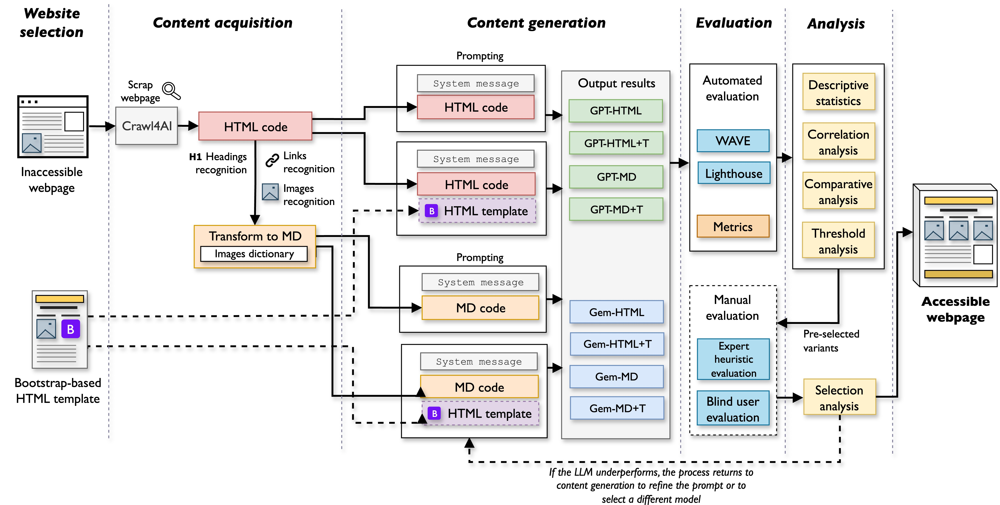

# Accessible Web Content Generation Using LLMs: An Empirical Study on Prompting Strategies and Template-Guided Remediation

This repository contains the source code and associated files to replicate the experiments described in our submission to *IEEE Latin America Transactions* (Submission ID: 9994). This README provides an overview of the repository structure, manuscript details, and usage instructions.

## Manuscript Information

**Title:** Accessible Web Content Generation Using LLMs: An Empirical Study on Prompting Strategies and Template-Guided Remediation  
**Submission ID:** 9994

### Authors

**Guillermo Vera-Amaro**  
*Universidad Veracruzana*  
Email: gvera@uv.mx  

**José Rafael Rojano-Cáceres**  
*Universidad Veracruzana*  
Email: rrojano@uv.mx  

### Abstract

Web accessibility remains a persistent challenge, especially for visually impaired users. This study explores the use of large language models (LLMs) to address accessibility barriers through structured prompt engineering. We evaluate the performance of GPT-4o and Gemini 2.0 Flash across two real-world websites using HTML and Markdown input formats, with and without the use of accessibility-aware templates. Generated outputs are assessed using automated tools (WAVE and Lighthouse), token usage metrics, and expert reviews via the Barrier Walkthrough method. Results show that both models consistently achieved accessibility scores above 95. Template-guided prompts led to significant improvements in WAVE compliance and semantic structure. Statistical analyses indicate that GPT-4o was more token-efficient, while Gemini produced more visually dynamic outputs. Nonetheless, some accessibility issues persisted, highlighting the importance of human-in-the-loop validation. The proposed methodology offers a reproducible and effective approach to streamlining accessibility remediation with generative AI.

## Repository Structure

The repository is organized as follows:

- `llm-prompt.ipynb`: Main notebook to reproduce the experiment. Includes setup for scraping tools, HTML/Markdown input handling, LLM-based generation, result comparison, statistical analysis, and visualization.
- `figures/`: This folder contains all figures automatically generated by the notebook.
- ìmages/`: This folder contains explanatory visual assets accompanying the code and article.
- `output/`: This folder stores generated HTML variants produced by each model across different configurations.
- `templates/`: This folder includes the accessibility-aware templates used in the generation prompts.
  
A Python environment capable of running Jupyter Notebooks is required. Supported options include:

- Visual Studio Code (offline)
- Jupyter Notebook (local or online)
- Google Colab (online)

## Usage Instructions

1. Open `llm-prompt.ipynb` in your chosen notebook environment.
2. Run the notebook sequentially to reproduce the experiment.

## Additional Notes

For full details on the methodology and results, refer to the associated article.
